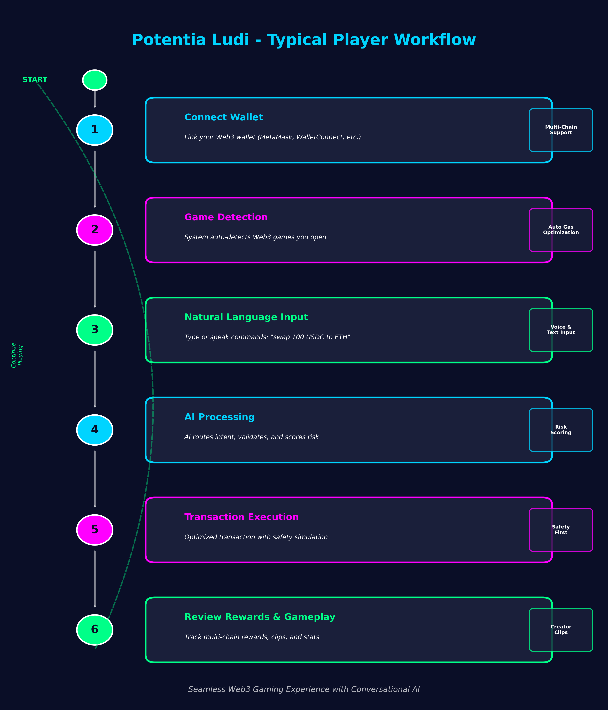
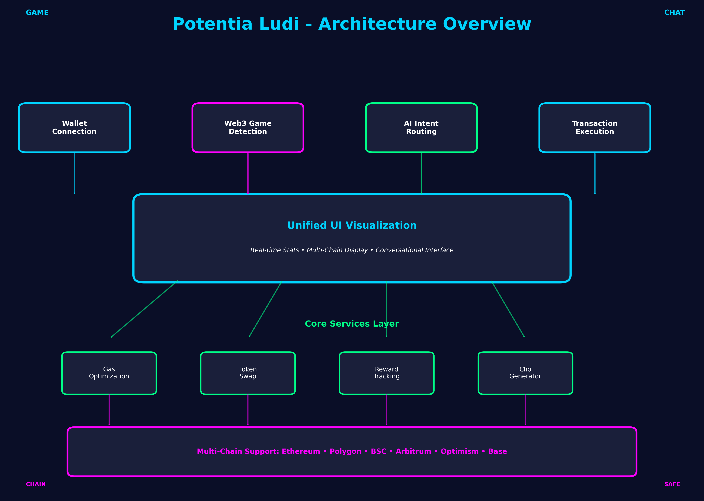

# Potentia Ludi 🎮

A Universal On-Chain Gaming Wallet Hub with Conversational AI – a revolutionary app that combines natural language interaction with Web3 gaming. Talk to your wallet to check balances, swap tokens, or bridge assets. Auto-detects games you play, optimizes gas, tracks rewards across chains, and auto-generates creator-ready clips with stats overlays.

## 🌟 What Makes Us Different

Unlike traditional Web3 wallets that require technical knowledge of blockchain operations, Potentia Ludi introduces a **Conversational AI Interface** that lets you interact with your wallet using plain English. Simply type commands like:

- "What's my USDC balance on Polygon?"
- "Swap 1 ETH for MATIC"
- "Bridge 100 tokens to Arbitrum"
- "Show me my last 10 transactions"

Our intelligent NL → Intent pipeline powered by OpenAI understands your requests, validates safety, and executes blockchain operations – making Web3 accessible to everyone, not just crypto experts.

## Core Features

### 💬 Conversational Wallet Interface (NEW!)
- **Natural Language Commands**: Interact with your wallet using plain English
- **AI-Powered Intent Recognition**: OpenAI-based NLP pipeline understands your requests
- **Smart Safety Checks**: Multi-layer validation prevents errors and fraud
- **Contextual Understanding**: Remembers your preferences and transaction history
- **Multi-Step Operations**: Handle complex workflows like "swap and bridge" in one command

### 🔍 Auto Game Detection
- Automatically detects Web3 games when you open them
- Monitors known gaming platforms across multiple chains
- Supports Axie Infinity, Gods Unchained, The Sandbox, Decentraland, and more
- Custom game addition support

### ⛽ Gas Optimization
- Real-time gas price monitoring across all major chains
- Automatic transaction optimization to reduce costs
- Smart scheduling for non-urgent transactions
- Average savings of 30% on gas fees

### 🔄 Automatic Token Swaps
- Behind-the-scenes token swapping when games need specific tokens
- Aggregates best routes from multiple DEX platforms
- Minimal slippage with optimal routing
- Supports all major tokens and chains

### 🏆 Multi-Chain Reward Tracking
- Tracks rewards across Ethereum, Polygon, BSC, Arbitrum, Optimism, and Base
- Real-time USD value calculation
- One-click reward claiming
- Comprehensive reward history

### 🎬 Creator-Ready Clips & Stats
- Automatic recording of gaming sessions
- Real-time stats overlay generation
- Track transactions, gas spent, rewards earned, and win rates
- Export clips with professional stats overlays
- Social media ready format

## Technology Stack

### Frontend
- **Framework**: React 18 + TypeScript (transitioning to Next.js 16)
- **State Management**: Zustand
- **Web3 Integration**: Ethers.js v6, Wagmi, Viem
- **Build Tool**: Vite (migrating to Next.js App Router)
- **Styling**: Inline styles with CSS animations

### Backend (In Development)
- **Runtime**: Node.js 20+ (target: 24+)
- **Framework**: Next.js 16 API Routes / Server Actions
- **Database**: PostgreSQL 15+ (schema defined)
- **Cache**: Redis 7+ (caching layer ready)
- **AI/NLP**: OpenAI GPT-4 Responses API

### Conversational AI Pipeline
- **Intent Recognition**: Custom NL → Intent parser
- **Safety Layer**: Multi-tier validation and confirmation
- **Workflow Orchestration**: Modular service architecture
- **Transaction Execution**: Ethers.js with hardware wallet support

## Getting Started

### Prerequisites
- **Node.js**: 20+ (Node.js 24+ recommended for full feature support)
- **npm**: 8+ or **yarn**: 1.22+
- **PostgreSQL**: 15+ (for backend features)
- **Redis**: 7+ (for caching layer)

### Installation

1. Clone the repository:
```bash
git clone https://github.com/elove333/https-github.com-elove333-potentia-ludi.git
cd https-github.com-elove333-potentia-ludi
```

2. Install dependencies:
```bash
npm install
```

3. Configure environment variables:
```bash
cp .env.example .env
# Edit .env and add your API keys:
# - OPENAI_API_KEY (for conversational features)
# - DATABASE_URL (PostgreSQL connection string)
# - REDIS_URL (Redis connection string)
# - NEXT_PUBLIC_CDP_API_KEY (Coinbase API key)
```

4. Setup database (optional, for backend features):
```bash
npm run db:setup    # Initialize PostgreSQL schema
npm run db:migrate  # Run migrations
```

5. Start the development server:
```bash
npm run dev
```

6. Open http://localhost:3000 in your browser

### Building for Production

```bash
npm run build
```

The build output will be in the `dist` directory.

## Usage

### Typical Player Workflow



The diagram above shows the typical step-by-step process for players interacting with Potentia Ludi, from connecting their wallet to reviewing rewards and continuing gameplay.

### Traditional Wallet Mode
1. **Connect Your Wallet**: Click "Connect Wallet" to link your Web3 wallet
2. **Enable Features**: Toggle gas optimization and auto-swap features as needed
3. **Play Games**: Open any supported Web3 game, and it will be auto-detected
4. **Record Sessions**: Click "Record" on any detected game to capture your gameplay
5. **Track Rewards**: Monitor your cross-chain rewards in real-time
6. **View Clips**: Access your recorded clips with embedded stats overlays

### Conversational Mode (In Development)
1. **Start Chat**: Click the chat icon to open the conversational interface
2. **Type Commands**: Use natural language like "What's my balance?" or "Swap 1 ETH for USDC"
3. **Review Intent**: System shows what it understood and asks for confirmation
4. **Confirm & Execute**: Review the details and confirm to execute
5. **Track Status**: Monitor your transaction in real-time

### Example Commands
- `"Show my USDC balance on Polygon"`
- `"Swap 1 ETH for maximum USDC"`
- `"Bridge 100 MATIC to Ethereum mainnet"`
- `"What's the gas price on Arbitrum?"`
- `"Show my transaction history for last week"`

## Architecture

### Architecture Overview



The architecture diagram above illustrates the key components of Potentia Ludi, showing how wallet connection, Web3 game detection, AI intent routing, and transaction execution work together through a unified UI visualization layer.

See [ARCHITECTURE.md](./ARCHITECTURE.md) for complete architectural specifications including:
- High-level system design
- NL → Intent pipeline details
- Component workflows
- Backend services architecture
- Safety policies
- MVP criteria and roadmap

### Core Services

- **gameDetection.ts**: Monitors URLs and blockchain transactions to detect Web3 games
- **gasOptimization.ts**: Tracks gas prices and optimizes transaction parameters
- **tokenSwap.ts**: Handles automatic token swapping with DEX aggregation
- **rewardTracking.ts**: Monitors and tracks rewards across multiple chains
- **clipGenerator.ts**: Records gameplay and generates clips with stats overlays

### Conversational AI Components (In Development)

- **NL Pipeline**: 
  - `src/ai/openai-client.ts` - OpenAI Responses API integration
  - `src/ai/intent-parser.ts` - Convert NL to structured intents
  - `src/ai/parameter-validator.ts` - Validate intent parameters
  
- **Workflow Services**:
  - `src/workflows/balances/` - Balance query operations
  - `src/workflows/trade/` - Token swap operations
  - `src/workflows/bridge/` - Cross-chain transfer operations
  
- **Safety Layer**:
  - `src/safety/validator.ts` - Multi-tier validation
  - `src/safety/confirmation.ts` - User confirmation handlers
  - `src/safety/rate-limiter.ts` - Rate limiting logic

### State Management

- **gamingWalletStore.ts**: Zustand store managing wallet state, games, rewards, and clips
- **conversationStore.ts**: (Planned) Manages chat history and intent state

### Components

- **App.tsx**: Main application container
- **WalletDashboard.tsx**: Wallet connection and feature toggles
- **DetectedGames.tsx**: Shows auto-detected games with recording controls
- **RewardsPanel.tsx**: Displays cross-chain rewards with claim functionality
- **ClipsGallery.tsx**: Gallery of recorded clips with stats

## Supported Chains

- Ethereum (Chain ID: 1)
- Polygon (Chain ID: 137)
- BSC (Chain ID: 56)
- Arbitrum (Chain ID: 42161)
- Optimism (Chain ID: 10)
- Base (Chain ID: 8453)

## Supported Games

- Axie Infinity (Ronin)
- Gods Unchained (IMX)
- The Sandbox (Ethereum)
- Decentraland (Polygon)
- Custom game support

## Development

### Project Structure
```
potentia-ludi/
├── src/
│   ├── components/          # React components
│   │   ├── WalletDashboard.tsx
│   │   ├── DetectedGames.tsx
│   │   ├── RewardsPanel.tsx
│   │   └── ClipsGallery.tsx
│   ├── services/            # Core business logic services
│   │   ├── gameDetection.ts
│   │   ├── gasOptimization.ts
│   │   ├── tokenSwap.ts
│   │   ├── rewardTracking.ts
│   │   └── clipGenerator.ts
│   ├── workflows/           # Conversational AI workflows (NEW)
│   │   ├── balances/
│   │   │   ├── balances.get.ts
│   │   │   ├── balances.track.ts
│   │   │   └── types.ts
│   │   ├── trade/
│   │   │   ├── trade.swap.ts
│   │   │   ├── trade.quote.ts
│   │   │   └── types.ts
│   │   ├── bridge/
│   │   │   ├── bridge.transfer.ts
│   │   │   ├── bridge.estimate.ts
│   │   │   └── types.ts
│   │   └── shared/
│   │       ├── validation.ts
│   │       └── confirmation.ts
│   ├── ai/                  # AI/NLP components (NEW)
│   │   ├── openai-client.ts
│   │   ├── intent-parser.ts
│   │   └── parameter-validator.ts
│   ├── backend/             # Backend services (NEW)
│   │   ├── database/
│   │   │   ├── schema.sql
│   │   │   └── client.ts
│   │   ├── cache/
│   │   │   └── redis-client.ts
│   │   └── api/
│   │       └── intents.ts
│   ├── safety/              # Safety layer (NEW)
│   │   ├── validator.ts
│   │   ├── confirmation.ts
│   │   └── rate-limiter.ts
│   ├── store/               # State management
│   │   ├── gamingWalletStore.ts
│   │   └── conversationStore.ts
│   ├── types/               # TypeScript type definitions
│   │   └── index.ts
│   ├── utils/               # Utility functions
│   ├── styles.css           # Global styles
│   └── index.tsx            # Application entry point
├── app/                     # Next.js App Router (NEW)
│   ├── page.tsx
│   └── api/
│       └── intents/
│           └── route.ts
├── ARCHITECTURE.md          # Complete architectural specs (NEW)
├── IMPLEMENTATION.md        # Implementation summary
├── README.md                # This file
└── package.json
```

### Available Scripts

- `npm run dev` - Start development server
- `npm run build` - Build for production
- `npm run preview` - Preview production build
- `npm run lint` - Run ESLint
- `npm run test` - Run tests
- `npm run db:setup` - Initialize database schema (requires PostgreSQL)
- `npm run db:migrate` - Run database migrations
- `npm run redis:start` - Start Redis server locally

## Contributing

We welcome contributions! Here's how you can help:

### Getting Started
1. Fork the repository
2. Create a feature branch: `git checkout -b feature/your-feature-name`
3. Make your changes following our coding standards
4. Run tests: `npm test`
5. Commit your changes: `git commit -m 'Add some feature'`
6. Push to the branch: `git push origin feature/your-feature-name`
7. Open a Pull Request

### Areas for Contribution

**Conversational AI Pipeline**
- Improve intent recognition accuracy
- Add support for new intent types
- Enhance safety validation rules
- Optimize response times

**Workflow Extensions**
- Implement new workflow services (NFT operations, staking, etc.)
- Add support for new chains
- Integrate additional DEX aggregators
- Improve error handling

**Backend Infrastructure**
- Optimize database queries
- Enhance caching strategies
- Add monitoring and observability
- Improve API documentation

**UI/UX Improvements**
- Design conversational chat interface
- Enhance mobile responsiveness
- Add accessibility features
- Improve error messages

### Extension Points

See [ARCHITECTURE.md](./ARCHITECTURE.md#extension-points) for detailed guides on:
- Adding new intents
- Integrating new chains
- Custom DEX integration
- Custom safety rules

### Code Style
- Use TypeScript for all new code
- Follow existing naming conventions
- Add JSDoc comments for public APIs
- Write tests for new features
- Keep functions small and focused

## License

MIT License - see LICENSE file for details
